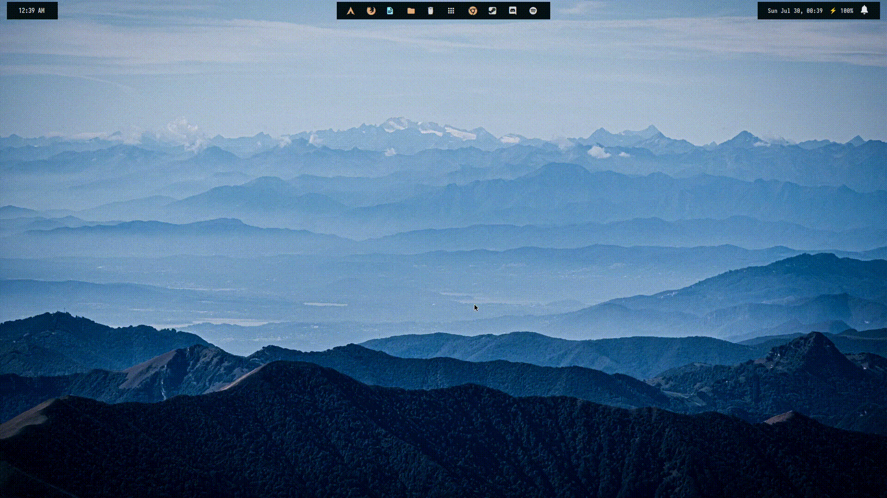
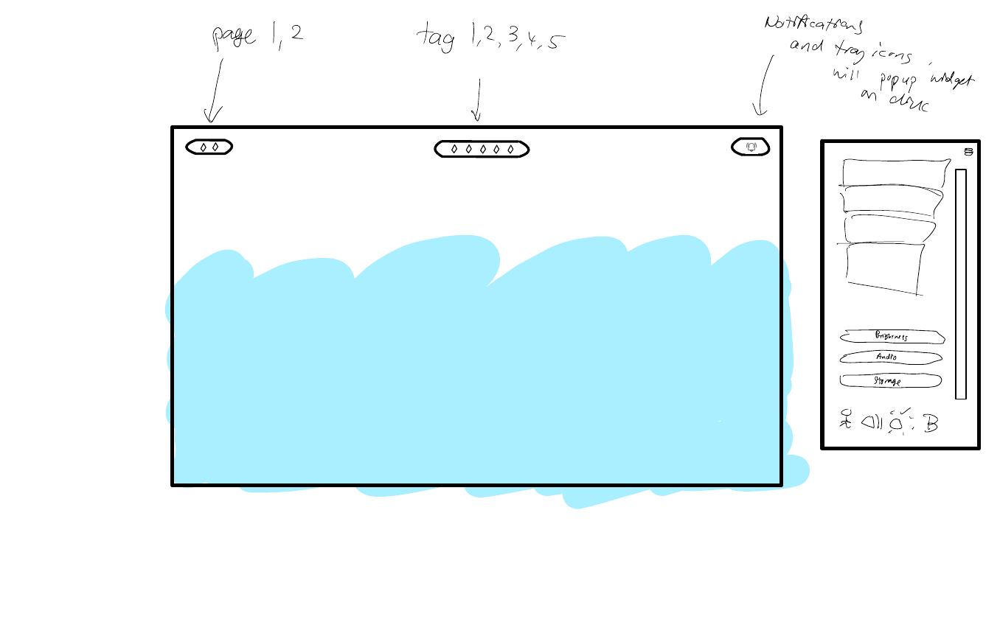
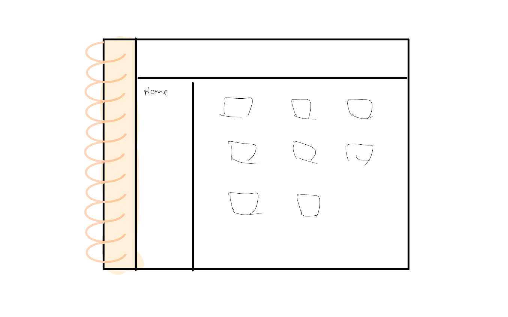

# What is this?

My AwesomeWM Build with designs based on personal preferences aka. my ULTIMATE build !! <br/>
This is a unique design of window manager that will have 10 tags <br/>
with first 5 tags showing as page 1, another 5 tags showing as page 2

# Progress

Screenshot of Current Progress



# Design

My Designs on Paper <br/>
Design of bar

Design of titlebar on file browser


# Usage

### How to use my setup?<br />

I have set my Modkey to Windows Key! If you do prefer Alt Key, set modkey to Mod1 in rc.lua!<br />
Here are the default keybindings that I have customized to my likings:<br />
Switching tags:<br />

```
Modkey+1 - switch to tag 1<br />
Modkey+2 - switch to tag 2<br />
Modkey+3 - switch to tag 3<br />
Modkey+4 - switch to tag 4<br />
Modkey+5 - switch to tag 5<br />
Modkey+F1 - switch to tag 6<br />
Modkey+F2 - switch to tag 7<br />
Modkey+F3 - switch to tag 8<br />
Modkey+F4 - switch to tag 9<br />
Modkey+F5 - switch to tag 10<br />
```

Switch Focus between apps:<br />

```
Modkey+K - next app<br />
Modkey+J - previous app<br />
Modkey+Enter - move currently focus app to main stack(switching app order)<br />
```

Moving app between tags:<br />
focus on the app that u want to move,<br />

```
ModKey+Shift+1-F5 - move app to tag 1-10<br />
```

Launching app:<br />

```
Modkey+P - runs rofi launchpad, choose with arrow keys and enter to launch<br />
```

Launching terminal(alacritty):<br />

```
Modkey+Shift+Enter - launch alacritty terminal<br />
```

(Do feel free to change and modify them to your own likings!)

# Credits

Inspirations from: <br/>
edr3x - [https://github.com/edr3x/.dotfiles](https://github.com/edr3x/.dotfiles) <br/>
rklyz - [https://github.com/rklyz/MyRice](https://github.com/rklyz/MyRice) <br/>
HoNamHuong - [https://github.com/HoNamDuong/.dotfiles.git](https://github.com/HoNamDuong/.dotfiles.git)

Huge shoutout to them <3

Libraries Used: <br/>
Bling - [https://github.com/BlingCorp/bling.git](https://github.com/BlingCorp/bling.git) <br/>
Rubato - [https://github.com/andOrlando/rubato.git](https://github.com/andOrlando/rubato.git) <br/>

Background Picture: <br/>
Fabrizio Conti - [mountains under blue and grey sky](https://unsplash.com/photos/_6LZtmrss08) <br/>

Big thanks to these pioneers!
